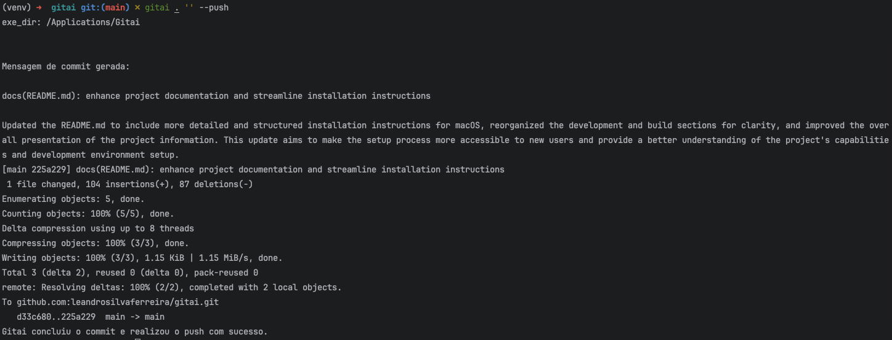
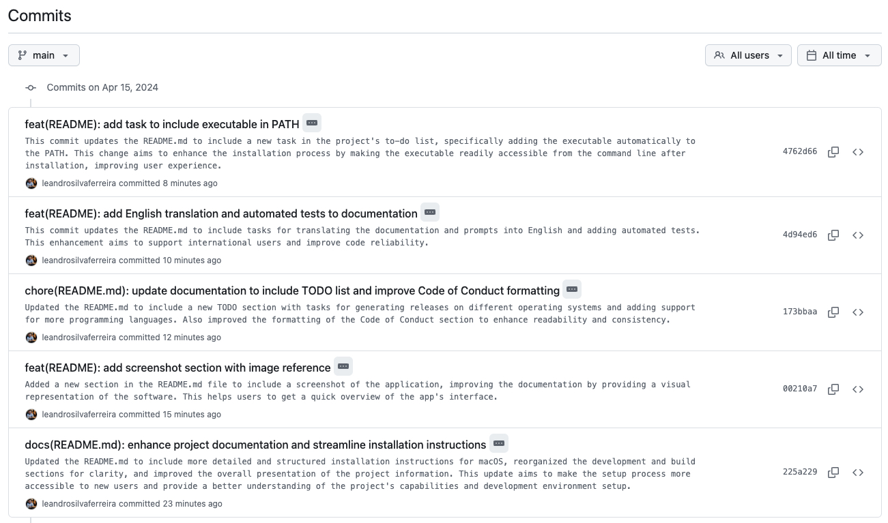

# Gitai - Conventional Commits automatizados no Git com IA

[](https://github.com/leandrosilvaferreira/gitai/releases)
[](https://star-history.com/#leandrosilvaferreira/gitai)
[](https://github.com/leandrosilvaferreira/gitai/fork)

Gitai é um projeto Python que serve como uma ferramenta de automação para gerenciamento de commits no Git. Ele é projetado para analisar projetos escritos em várias linguagens de programação, incluindo Node.js, Python, Java, Go e PHP.

A aplicação analisa as alterações feitas em um projeto, identifica a linguagem de programação usada e, com base nisso, gera uma mensagem de commit detalhada seguindo o padrão Conventional Commits. Este padrão é amplamente adotado para tornar as mensagens de commit mais descritivas e úteis.

Além disso, Gitai automatiza o processo de commit, adicionando todas as alterações ao índice do Git, realizando o commit com a mensagem gerada e, opcionalmente, fazendo push das alterações para o repositório remoto.

O projeto também utiliza as bibliotecas `openai`, `python-dotenv` e `pyinstaller` para criar um executável que inclui as dependências do ambiente virtual e que lê as variáveis de ambiente de um arquivo `.env` na mesma pasta que o executável.

## 💻 Screenshot





## ⚡ Instalando a Aplicação no Mac

Depois de gerar o arquivo `.pkg`, você pode seguir os passos abaixo para instalar a aplicação no seu Mac:

1. Navegue até o local onde o arquivo `.pkg` foi salvo.
2. Dê um duplo clique no arquivo `.pkg` para iniciar o instalador.
3. Siga as instruções na tela para instalar a aplicação. Você pode precisar inserir sua senha de administrador.
4. Após a instalação, a aplicação estará disponível no seu diretório de Aplicativos.

Lembre-se de que, após a instalação, você deve configurar o arquivo `.env` com as variáveis de ambiente necessárias para a aplicação funcionar corretamente.

## 🌱 Configurando o .env

Antes de executar o aplicativo, você precisa configurar o arquivo `.env` na pasta `dist` ou na pasta onde o GITAI foi instalado. Este arquivo contém as variáveis de ambiente que o aplicativo precisa para funcionar corretamente.

Abra o arquivo `.env` em um editor de texto e preencha as variáveis de ambiente. Por exemplo:

```dotenv
OPENAI_API_KEY=your_openai_api_key
OPENAI_MODEL=gpt-3.5-turbo
LANGUAGE=en
```

## 💻 Adicionando o Aplicativo ao Terminal

Para tornar o aplicativo disponível no terminal, você precisa adicionar o diretório do aplicativo ao `PATH` do sistema. O `PATH` é uma variável de ambiente que especifica uma lista de diretórios onde os comandos executáveis são procurados.

Você pode adicionar o diretório do aplicativo ao `PATH` adicionando a seguinte linha ao arquivo `.bash_profile` ou `.zshrc` (dependendo do shell que você está usando) no diretório inicial do usuário:

```bash
export PATH="$PATH:/Applications/Gitai/"
```

Depois de adicionar essa linha, você precisa executar o comando `source` para carregar as alterações:

```bash
source ~/.bash_profile  # Se você estiver usando bash
source ~/.zshrc  # Se você estiver usando zsh
```

Agora, você deve ser capaz de executar o aplicativo a partir do terminal.

## 🚀 Usando o Gitai

Depois de instalar e configurar o Gitai, você pode começar a usá-lo para gerar mensagens de commit automaticamente para o seu projeto.

Para usar o Gitai, você precisa abrir o terminal na raiz do seu projeto. Isso é importante porque o Gitai precisa ter acesso aos arquivos do seu projeto para analisar as alterações e gerar as mensagens de commit.

Uma vez que o terminal esteja aberto na raiz do seu projeto, você pode executar o Gitai com o seguinte comando:

```bash
gitai <caminho_do_projeto> '<mensagem_genérica>'
```

Substitua `<caminho_do_projeto>` pelo caminho do diretório do seu projeto e `<mensagem_genérica>` por uma descrição básica da mudança que você fez no projeto.

Se você estiver com o terminal aberto na raiz do seu projeto e a mudança foi para adicionar uma nova funcionalidade, você pode simplesmente digitar:

```bash
gitai . 'Adicionada nova funcionalidade'
```

Se você deseja analisar somente uma pasta específica ou um projeto em outra pasta, por exemplo, se você fez uma alteração no seu projeto localizado em `/Users/username/MeuProjeto`, você pode executar o Gitai com o seguinte comando:

```bash
gitai /Users/username/MeuProjeto 'Adicionada nova funcionalidade'
```

## 👨‍💻 Desenvolvimento

### Pré-requisitos

- Python 3.7 ou superior
- pip (gerenciador de pacotes do Python)
- git

### Configuração do Ambiente

1. Clone o repositório para a sua máquina local usando `git clone`.

```bash
git clone <url-do-repositorio>
```

2. Navegue até o diretório do projeto.

```bash
cd <nome-do-projeto>
```

3. Instale as dependências do projeto.

```bash
pip install -r requirements.txt
```

### Gerando o executável

Para executar o build do projeto, execute o script `build.sh` na raiz do projeto.

```bash
./build.sh
```

Este script irá gerar um executável do script Python usando o PyInstaller chamado `gitai` e copiará o arquivo `.env.example` para a pasta `dist`.

Caso você queira gerar um executável para uma plataforma específica, você pode usar os seguintes comandos:

### Gerando o Instalador para Windows

Para gerar um instalador para Windows, você precisa usar a ferramenta Inno Setup.

#### Instalando o Inno Setup

1. Acesse o site oficial do Inno Setup em http://www.jrsoftware.org/isinfo.php
2. Clique no link "Download" na página.
3. Baixe a versão mais recente do Inno Setup.
4. Após o download do arquivo `.exe`, abra-o.
5. Siga as instruções na tela para instalar o Inno Setup.
6. Após a instalação, o Inno Setup deve estar disponível no seu computador.
7. Abra o Inno Setup e clique em "File" > "New" para criar um novo script de instalação.
8. Preencha os detalhes do seu projeto, como nome, versão e descrição.
9. Adicione os arquivos necessários ao instalador, incluindo o executável gerado pelo PyInstaller e o arquivo `.env` de exemplo.
10. Configure as opções de instalação, como o diretório de instalação e os atalhos.
11. Clique em "Build" para gerar o instalador.
12. Após a compilação, você terá um arquivo `.exe` que pode ser distribuído e usado para instalar o seu aplicativo no Windows.
13. Execute o instalador no computador de destino para instalar o aplicativo.
14. Após a instalação, o aplicativo estará disponível no menu Iniciar e no diretório de instalação.

### Gerando o Instalador para Linux

Para gerar um instalador para Linux, você precisa usar a ferramenta Makeself.

#### Instalando o Makeself

1. Acesse o site oficial do Makeself em https://makeself.io/
2. Clique no link "Download" na página.
3. Baixe a versão mais recente do Makeself.
4. Após o download do arquivo `.run`, abra-o.
5. Siga as instruções na tela para instalar o Makeself.
6. Após a instalação, o Makeself deve estar disponível no seu computador.
7. Abra o terminal e navegue até o diretório onde o executável gerado pelo PyInstaller está localizado.
8. Execute o seguinte comando para criar o instalador:

```bash
makeself <diretório_de_origem> <nome_do_instalador> "<descrição_do_instalador>" <comando_de_instalação>
```

Substitua `<diretório_de_origem>` pelo diretório onde o executável gerado pelo PyInstaller está localizado, `<nome_do_instalador>` pelo nome do arquivo do instalador, `<descrição_do_instalador>` por uma descrição do instalador e `<comando_de_instalação>` por um comando de instalação.

Por exemplo:

```bash
makeself dist/ GitaiInstaller.run "Instalador do Gitai" "./gitai"
```

Isso irá criar um arquivo `.run` que pode ser distribuído e usado para instalar o seu aplicativo no Linux.

### Gerando o Instalador para macOS

Para gerar um instalador para macOS, você precisa usar a ferramenta Packages.

#### Instalando o Packages

1. Acesse o site oficial do Packages em http://s.sudre.free.fr/Software/Packages/about.html
2. Clique no link "Download" na página.
3. Após o download do arquivo `.dmg`, abra-o.
4. Arraste o ícone do Packages para a pasta de Aplicativos.

Agora, o Packages deve estar instalado e pronto para uso no seu Mac.

#### Criando o Instalador

1. Abra o Packages e clique em "New Project".
2. Selecione "Distribution" e clique em "Next".
3. Dê um nome ao seu projeto e escolha onde salvá-lo.
4. No painel esquerdo, clique em "Project" e preencha os detalhes do seu projeto.
5. No painel esquerdo, clique em "Settings" e configure as opções de instalação.
6. No painel esquerdo, clique em "Scripts" e adicione um script de pós-instalação que instala as bibliotecas Python necessárias.
7. No painel esquerdo, clique em "Payload" e adicione o executável e o arquivo `.env` de exemplo ao diretório de instalação.
8. No menu "Build", selecione "Build".

Isso irá criar um arquivo `.pkg` que instala o seu aplicativo.

O Gitai irá analisar as alterações feitas no seu projeto, identificar a linguagem de programação usada e, com base nisso, gerar uma mensagem de commit detalhada seguindo o padrão Conventional Commits. Em seguida, ele irá adicionar todas as alterações ao índice do Git e realizar o commit com a mensagem gerada.

## 📝 TODO

- [x] Gerar release para Mac
- [x] Gerar release para Windows
- [x] Gerar release para Linux
- [x] Atualizar a documentação para incluir instruções de instalação para Windows e Linux
- [ ] Adicionar possibilidade de utilizar a API do GROQ para gerar mensagens de commit
- [ ] Adicionar binário executável automaticamente no PATH
- [ ] Adicionar suporte para mais linguagens de programação
- [ ] Traduzir a documentação para Inglês
- [ ] Traduzir prompts para Inglês
- [ ] Adicionar testes automatizados


## 🙌 Contribuindo

Agradecemos o seu interesse em contribuir para o Gitai! Aqui estão algumas diretrizes que podem ajudá-lo no processo:

1. **Fork o Repositório**: Faça um fork do repositório Gitai para a sua conta do GitHub. Isso significa que você terá uma cópia do repositório em sua própria conta, permitindo que você faça alterações sem afetar o projeto original.

2. **Clone o Repositório**: Clone o repositório para a sua máquina local para que você possa fazer alterações.

3. **Crie uma Branch**: Crie uma nova branch em seu fork para fazer suas alterações. Isso ajuda a separar suas alterações de outras que possam estar acontecendo simultaneamente.

4. **Faça suas Alterações**: Faça as alterações que você acha que melhorariam o projeto. Isso pode ser a adição de uma nova funcionalidade, a correção de um bug ou a melhoria da documentação.

5. **Teste suas Alterações**: Certifique-se de que suas alterações não quebram nada e que o código ainda funciona como esperado.

6. **Envie um Pull Request**: Envie um pull request para o repositório original propondo suas alterações. Certifique-se de dar uma descrição detalhada de suas alterações para que os mantenedores do projeto possam entender o que você fez e por quê.

## 📄 Código de Conduta

Pedimos que todos os contribuintes sigam nosso código de conduta. Respeito mútuo é fundamental para um ambiente de colaboração saudável. Por favor, seja profissional e respeitoso com os outros contribuintes.

## 🙋 Suporte

Se você tiver alguma dúvida ou problema, por favor, abra uma issue. Faremos o nosso melhor para ajudá-lo.

## 📨 Contato

Se você quiser entrar em contato com os mantenedores do projeto, por favor, envie um e-mail para: [leandro@notyped.com](mailto:leandro@notyped.com)

Obrigado por seu interesse em nosso projeto. Estamos ansiosos para ver suas contribuições!

## 🤓 Autor

**Leandro Silva Ferreira**

- GitHub: [@leandrosilvaferreira](https://github.com/leandrosilvaferreira)
- Twitter: [@leandrosfer](https://twitter.com/leandrosfer)
- Email: [leandro@notyped.com](mailto:leandro@notyped.com)
- LinkedIn: [Leandro Ferreira](https://www.linkedin.com/in/leandrosilvaferreira/)

## 🙌 Contribuidores

Obrigado a estes incríveis contribuidores

<a href="https://github.com/leandrosilvaferreira/gitai/graphs/contributors">

</a>

[](https://star-history.com/#leandrosilvaferreira/gitai&Date)

## 📄 Licença

Este projeto está licenciado sob a licença MIT. Isso significa que você é livre para copiar, modificar, mesclar, publicar, distribuir, sublicenciar e/ou vender cópias do software, desde que forneça o devido crédito ao autor original e reproduza a licença em todas as cópias ou partes substanciais do software.

Para mais detalhes, veja o arquivo [LICENSE](LICENSE.md) no repositório.
