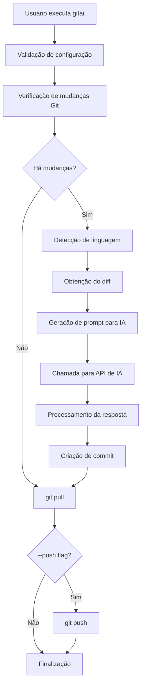

# Arquitetura do Projeto Gitai

## 📋 Sumário Executivo

O **Gitai** é uma ferramenta de automação desenvolvida em Python que utiliza inteligência artificial para gerar mensagens de commit seguindo o padrão Conventional Commits. A aplicação analisa mudanças em projetos de múltiplas linguagens de programação e automatiza o processo de commit e push no Git.

## 🏗️ Visão Geral da Arquitetura

### Arquitetura de Alto Nível

```
┌─────────────────────────────────────────────────────────────┐
│                    GITAI APPLICATION                        │
├─────────────────────────────────────────────────────────────┤
│  CLI Interface (gitai.py)                                  │
├─────────────────────────────────────────────────────────────┤
│  ┌─────────────────┐  ┌─────────────────┐  ┌──────────────┐│
│  │ Project Language│  │ AI Integration  │  │ Git Commands ││
│  │ Detection       │  │ (OpenAI/Groq)   │  │ Management   ││
│  └─────────────────┘  └─────────────────┘  └──────────────┘│
├─────────────────────────────────────────────────────────────┤
│  ┌─────────────────┐  ┌─────────────────┐  ┌──────────────┐│
│  │ Configuration   │  │ Error Handling  │  │ File I/O     ││
│  │ Management      │  │ & Validation    │  │ Operations   ││
│  └─────────────────┘  └─────────────────┘  └──────────────┘│
└─────────────────────────────────────────────────────────────┘
```

### Componentes Principais

1. **Interface CLI** - Ponto de entrada da aplicação
2. **Detector de Linguagem** - Identifica tecnologias do projeto
3. **Integração com IA** - Gera mensagens de commit inteligentes
4. **Gerenciador Git** - Executa comandos Git
5. **Gerador de Release Notes** - Cria documentação de versões

## 📁 Estrutura do Projeto

```
gitai/
├── src/
│   └── gitai/
│       ├── gitai.py          # Aplicação principal
│       └── releaser.py       # Gerador de release notes
├── build/                    # Artefatos de build (PyInstaller)
├── dist/                     # Executáveis distribuíveis
├── docs/                     # Documentação e imagens
├── packager/                 # Configurações de empacotamento
├── requirements.txt          # Dependências Python
├── .env.example             # Modelo de configuração
├── build.sh                 # Script de build
├── createVirtualEnv.sh      # Script de ambiente virtual
├── gitai.spec              # Configuração PyInstaller
└── README.md               # Documentação principal
```

## 🔧 Componentes Técnicos Detalhados

### 1. Interface de Linha de Comando (CLI)

**Arquivo**: `src/gitai/gitai.py`

**Responsabilidades**:
- Processar argumentos da linha de comando
- Coordenar fluxo de execução
- Gerenciar configurações de ambiente

**Argumentos Aceitos**:
```bash
gitai <project_path> '<base_message>' [--push]
```

**Fluxo Principal**:
1. Validação de variáveis de ambiente
2. Detecção de mudanças não commitadas
3. Geração de mensagem de commit via IA
4. Execução de comandos Git (add, commit, pull, push)

### 2. Detector de Linguagem de Programação

**Função**: `detect_project_language(project_path)`

**Linguagens Suportadas**:
- **Node.js**: package.json, yarn.lock, package-lock.json
- **Python**: requirements.txt, Pipfile, pyproject.toml, setup.py
- **Java**: pom.xml, build.gradle, .java
- **Go**: go.mod, Gopkg.lock
- **PHP**: composer.json, index.php
- **Ruby**: Gemfile, Rakefile
- **Rust**: Cargo.toml, Cargo.lock
- **C#**: .csproj, .sln
- **Swift**: Package.swift, .xcodeproj
- **Dart**: pubspec.yaml
- **Scala**: build.sbt
- **Haskell**: stack.yaml, .cabal
- **E outras**

**Estratégia de Detecção**:
1. Verificação de arquivos indicadores na raiz
2. Verificação de extensões de arquivo
3. Busca recursiva em subdiretórios

### 3. Integração com Provedores de IA

**Provedores Suportados**:

#### OpenAI
- **Modelo**: gpt-4o (padrão)
- **Contexto**: 128K tokens
- **Custo**: $2.50/1M tokens (input), $10.00/1M tokens (output)
- **Tipo**: Serviço pago

#### Groq
- **Modelo**: mixtral-8x7b-32768 (padrão)
- **Contexto**: 32,768 tokens
- **Limites**: 30 req/min, 14,400 req/dia, 5,000 tokens/min
- **Tipo**: Serviço gratuito com limitações

**Função**: `call_provider_api(prompt)`

**Configuração de Chamada**:
```python
{
    "temperature": 0.5,
    "max_tokens": 500,
    "top_p": 1.0,
    "frequency_penalty": 0.0,
    "presence_penalty": 0.0
}
```

### 4. Geração de Mensagens de Commit

**Função**: `generate_commit_message(diff_output, project_language, base_message)`

**Padrão Conventional Commits**:
- **feat**: Nova funcionalidade
- **fix**: Correção de bug
- **docs**: Mudanças na documentação
- **chore**: Manutenção ou correções menores

**Estrutura da Mensagem**:
```
[prefix]: [descrição concisa]

[linha vazia]
[explicação detalhada das mudanças, razões e impacto]

🤖 Commit generated with Gitai
```

### 5. Gerenciamento de Comandos Git

**Função**: `run_git_command(command, exit_on_error=True)`

**Comandos Utilizados**:
- `git status --porcelain` - Verificar mudanças não commitadas
- `git diff` - Obter diferenças para análise da IA
- `git add .` - Adicionar arquivos ao staging
- `git commit -F <temp_file>` - Commit com mensagem de arquivo
- `git pull` - Sincronizar com repositório remoto
- `git push` - Enviar mudanças para repositório remoto

**Tratamento de Conflitos**:
- Detecção automática de conflitos durante pull
- Geração de commit de resolução automática
- Tratamento de erros com mensagens informativas

### 6. Gerador de Release Notes

**Arquivo**: `src/gitai/releaser.py`

**Funcionalidades**:
- Análise de commits desde última tag
- Categorização automática (Features, Bug Fixes, Other Changes)
- Geração de markdown formatado
- Suporte a múltiplos idiomas

**Uso**:
```bash
python releaser.py <old_tag> <new_version>
```

## 🛠️ Tecnologias e Dependências

### Dependências Principais

```python
# IA e APIs
openai==1.30.5          # Cliente OpenAI
groq==0.5.0             # Cliente Groq

# Configuração
python-dotenv==1.0.1    # Gerenciamento de variáveis de ambiente

# HTTP/Network
httpx==0.27.0           # Cliente HTTP assíncrono
httpcore==1.0.5         # Core HTTP
requests==2.31.0        # Cliente HTTP tradicional

# Build e Distribuição
pyinstaller==6.6.0     # Criação de executáveis

# Processamento de Dados
pydantic==2.7.0         # Validação de dados
PyYAML==6.0.1          # Parser YAML

# Utilitários
packaging==24.0         # Utilitários de empacotamento
```

### Ferramentas de Build

**PyInstaller**:
- Criação de executável standalone
- Inclusão de dependências do ambiente virtual
- Configuração via `gitai.spec`

**Scripts de Build**:
- `build.sh`: Build principal
- `createVirtualEnv.sh`: Criação de ambiente virtual

## 🔐 Configuração e Segurança

### Variáveis de Ambiente

**Arquivo**: `.env`

```bash
PROVIDER=groq|openai     # Provedor de IA
API_KEY=<sua_chave>      # Chave da API
MODEL=<modelo>           # Modelo específico
LANGUAGE=en|pt           # Idioma das mensagens
```

### Segurança

1. **Chaves de API**: Armazenadas em arquivo `.env` local
2. **Validação**: Verificação obrigatória de variáveis
3. **Isolamento**: Execução em ambiente virtual Python
4. **Sanitização**: Limpeza de saídas dos comandos Git

## 📊 Fluxo de Dados



## 🏛️ Padrões Arquiteturais

### 1. Command Pattern
- Encapsulamento de comandos Git em funções específicas
- Tratamento uniforme de erros e saídas

### 2. Strategy Pattern
- Seleção dinâmica de provedor de IA (OpenAI/Groq)
- Estratégias diferentes para detecção de linguagem

### 3. Template Method
- Fluxo padronizado para geração de commits
- Estrutura consistente de mensagens

### 4. Factory Pattern
- Criação de clientes de API baseada em configuração
- Instanciação dinâmica de provedores

## 🚀 Processo de Build e Distribuição

### Build Local
```bash
# 1. Criação do ambiente virtual
./createVirtualEnv.sh

# 2. Build do executável
./build.sh

# 3. Resultado em dist/gitai
```

### Distribuição Multi-plataforma

**macOS**:
- Geração de `.pkg` via Packages
- Script pós-instalação incluído
- Instalação em `/Applications/Gitai/`

**Windows**:
- Geração de instalador via Inno Setup
- Inclusão de dependências Python
- Registro no sistema

**Linux**:
- Criação de instalador via Makeself
- Arquivo `.run` auto-extraível
- Suporte a múltiplas distribuições

## 📈 Escalabilidade e Performance

### Otimizações Implementadas

1. **Cache de Detecção**: Evita re-análise desnecessária
2. **Streaming de Diff**: Processamento eficiente de grandes diffs
3. **Timeouts Configuráveis**: Prevenção de travamentos
4. **Validação Early**: Falha rápida em configurações inválidas

### Limitações Conhecidas

1. **Tamanho do Diff**: Limitado pelo contexto da IA (32K-128K tokens)
2. **Rate Limiting**: Especialmente com Groq (30 req/min)
3. **Dependência de Rede**: Requer conectividade para APIs de IA

## 🔍 Monitoramento e Logs

### Logging Implementado

```python
# Saídas informativas
print('Gitai v.0.2.4-beta')
print(f'Provider: {provider} - Model: {model}')
print('-> Gitai successfully committed local changes.')
```

### Tratamento de Erros

1. **Validação de Configuração**: Verificação de variáveis obrigatórias
2. **Erros de Git**: Captura e exibição de stdout/stderr
3. **Falhas de API**: Tratamento de timeouts e rate limits
4. **Conflitos de Merge**: Detecção e resolução automática

## 🎯 Casos de Uso Principais

### 1. Desenvolvimento Solo
```bash
# Commit rápido com mensagem melhorada
gitai . "fix bug in user authentication"
```

### 2. Desenvolvimento em Equipe
```bash
# Commit e push automático
gitai . "add user dashboard" --push
```

### 3. Geração de Release Notes
```bash
# Documentação de versão
python releaser.py v0.2.3 v0.2.4
```

### 4. Projetos Multilíngue
- Detecção automática de linguagem principal
- Suporte a projetos com múltiplas tecnologias
- Mensagens contextualizadas por linguagem

## 🔮 Roadmap e Evolução

### Funcionalidades Implementadas ✅
- [x] Suporte OpenAI e Groq
- [x] Múltiplas linguagens de programação
- [x] Builds multi-plataforma
- [x] Gerador de release notes
- [x] Documentação em múltiplos idiomas

### Próximos Passos 🔄
- [ ] Adição automática ao PATH
- [ ] Testes automatizados
- [ ] Configuração via arquivo de projeto
- [ ] Plugin para IDEs
- [ ] Análise de qualidade de código

## 🏗️ Considerações de Manutenibilidade

### Estrutura Modular
- Separação clara de responsabilidades
- Funções com propósito único
- Baixo acoplamento entre componentes

### Documentação
- Docstrings em funções críticas
- README detalhado em múltiplos idiomas
- Exemplos de uso abrangentes

### Testing Strategy
- Validação manual intensiva
- Testes em múltiplos sistemas operacionais
- Verificação de compatibilidade de dependências

## 🌐 Integração e Extensibilidade

### APIs Suportadas
- **OpenAI API**: Integração completa com GPT-4
- **Groq API**: Suporte a modelos Mixtral
- **Git CLI**: Comandos nativos do sistema

### Pontos de Extensão
1. **Novos Provedores de IA**: Padrão estabelecido para adição
2. **Detectores de Linguagem**: Sistema extensível de detecção
3. **Formatters de Mensagem**: Templates customizáveis
4. **Hooks de Build**: Scripts pré/pós processamento

---

## 📝 Conclusão

O Gitai representa uma solução robusta e bem arquitetada para automação de commits Git com IA. Sua arquitetura modular permite fácil manutenção e extensão, enquanto oferece uma experiência de usuário simplificada através de uma interface CLI intuitiva.

A escolha de Python como linguagem base, combinada com PyInstaller para distribuição, garante compatibilidade multiplataforma e facilidade de implantação. A integração com múltiplos provedores de IA oferece flexibilidade e redundância, atendendo diferentes necessidades de custo e performance.

**Data de Análise**: 01 de Julho de 2025  
**Versão Analisada**: v0.2.4-beta  
**Autor da Análise**: Assistente IA Agent Mode
